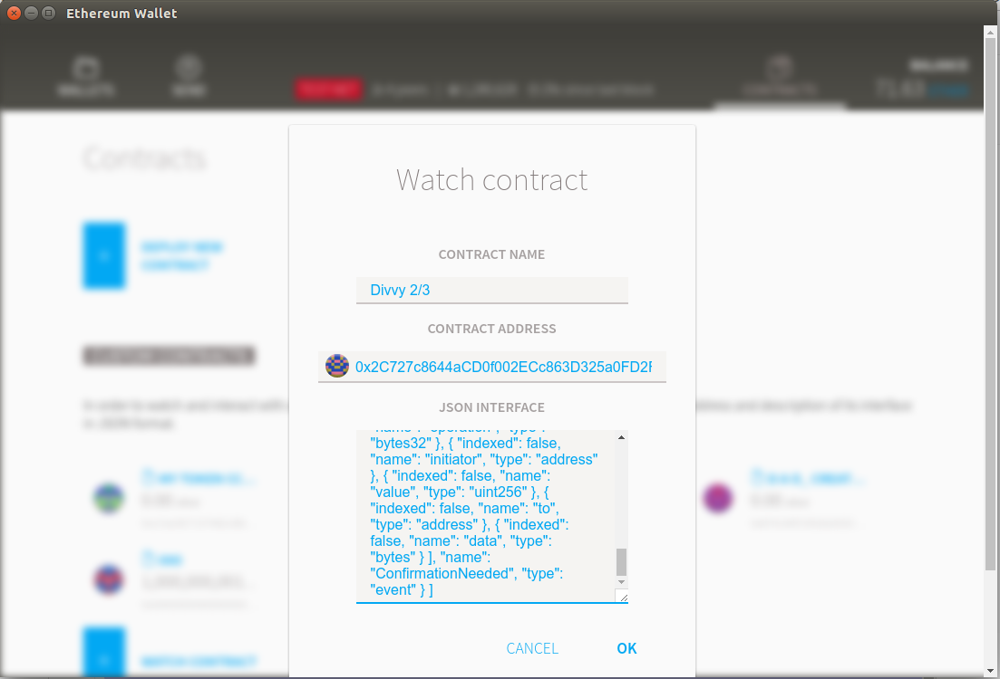

# Name
Divvy 2/3

# Address
 0x2C727c8644aCD0f002ECc863D325a0FD2F33C252 
 
 ON MORDEN TEST-NET ONLY DO NOT SEND LIVE ETHER
 
This Divvy-2-of-3 Multisig Repository Wallet represents 0x33E4f859693128eBF8b9f46F3F66ebbF39548e55, 0x27f7B84FF51fBcBb77e2EadD9F11020d2C019d34, and 0x09e422227021Cc65A757b8da8B419C0EEa49393e and requires 2-of-3 signatures to send more than zero ether per day. Releasing tokens from the Reserve will require a 'token' amount and will therefore require this same 2-of-3 rule to trigger the event.

# JSON Interface
[ { "constant": false, "inputs": [ { "name": "_owner", "type": "address" } ], "name": "removeOwner", "outputs": [], "type": "function" }, { "constant": false, "inputs": [ { "name": "_addr", "type": "address" } ], "name": "isOwner", "outputs": [ { "name": "", "type": "bool" } ], "type": "function" }, { "constant": true, "inputs": [], "name": "m_numOwners", "outputs": [ { "name": "", "type": "uint256", "value": "4" } ], "type": "function" }, { "constant": true, "inputs": [], "name": "m_lastDay", "outputs": [ { "name": "", "type": "uint256", "value": "16992" } ], "type": "function" }, { "constant": true, "inputs": [], "name": "version", "outputs": [ { "name": "", "type": "uint256", "value": "2" } ], "type": "function" }, { "constant": false, "inputs": [], "name": "resetSpentToday", "outputs": [], "type": "function" }, { "constant": true, "inputs": [], "name": "m_spentToday", "outputs": [ { "name": "", "type": "uint256", "value": "0" } ], "type": "function" }, { "constant": false, "inputs": [ { "name": "_owner", "type": "address" } ], "name": "addOwner", "outputs": [], "type": "function" }, { "constant": true, "inputs": [], "name": "m_required", "outputs": [ { "name": "", "type": "uint256", "value": "2" } ], "type": "function" }, { "constant": false, "inputs": [ { "name": "_h", "type": "bytes32" } ], "name": "confirm", "outputs": [ { "name": "", "type": "bool" } ], "type": "function" }, { "constant": false, "inputs": [ { "name": "_newLimit", "type": "uint256" } ], "name": "setDailyLimit", "outputs": [], "type": "function" }, { "constant": false, "inputs": [ { "name": "_to", "type": "address" }, { "name": "_value", "type": "uint256" }, { "name": "_data", "type": "bytes" } ], "name": "execute", "outputs": [ { "name": "_r", "type": "bytes32" } ], "type": "function" }, { "constant": false, "inputs": [ { "name": "_operation", "type": "bytes32" } ], "name": "revoke", "outputs": [], "type": "function" }, { "constant": false, "inputs": [ { "name": "_newRequired", "type": "uint256" } ], "name": "changeRequirement", "outputs": [], "type": "function" }, { "constant": true, "inputs": [ { "name": "_operation", "type": "bytes32" }, { "name": "_owner", "type": "address" } ], "name": "hasConfirmed", "outputs": [ { "name": "", "type": "bool", "value": false } ], "type": "function" }, { "constant": false, "inputs": [ { "name": "_to", "type": "address" } ], "name": "kill", "outputs": [], "type": "function" }, { "constant": false, "inputs": [ { "name": "_from", "type": "address" }, { "name": "_to", "type": "address" } ], "name": "changeOwner", "outputs": [], "type": "function" }, { "constant": true, "inputs": [], "name": "m_dailyLimit", "outputs": [ { "name": "", "type": "uint256", "value": "0" } ], "type": "function" }, { "inputs": [ { "name": "_owners", "type": "address[]" }, { "name": "_required", "type": "uint256" }, { "name": "_daylimit", "type": "uint256" } ], "type": "constructor" }, { "anonymous": false, "inputs": [ { "indexed": false, "name": "owner", "type": "address" }, { "indexed": false, "name": "operation", "type": "bytes32" } ], "name": "Confirmation", "type": "event" }, { "anonymous": false, "inputs": [ { "indexed": false, "name": "owner", "type": "address" }, { "indexed": false, "name": "operation", "type": "bytes32" } ], "name": "Revoke", "type": "event" }, { "anonymous": false, "inputs": [ { "indexed": false, "name": "oldOwner", "type": "address" }, { "indexed": false, "name": "newOwner", "type": "address" } ], "name": "OwnerChanged", "type": "event" }, { "anonymous": false, "inputs": [ { "indexed": false, "name": "newOwner", "type": "address" } ], "name": "OwnerAdded", "type": "event" }, { "anonymous": false, "inputs": [ { "indexed": false, "name": "oldOwner", "type": "address" } ], "name": "OwnerRemoved", "type": "event" }, { "anonymous": false, "inputs": [ { "indexed": false, "name": "newRequirement", "type": "uint256" } ], "name": "RequirementChanged", "type": "event" }, { "anonymous": false, "inputs": [ { "indexed": false, "name": "from", "type": "address" }, { "indexed": false, "name": "value", "type": "uint256" } ], "name": "Deposit", "type": "event" }, { "anonymous": false, "inputs": [ { "indexed": false, "name": "owner", "type": "address" }, { "indexed": false, "name": "value", "type": "uint256" }, { "indexed": false, "name": "to", "type": "address" }, { "indexed": false, "name": "data", "type": "bytes" } ], "name": "SingleTransact", "type": "event" }, { "anonymous": false, "inputs": [ { "indexed": false, "name": "owner", "type": "address" }, { "indexed": false, "name": "operation", "type": "bytes32" }, { "indexed": false, "name": "value", "type": "uint256" }, { "indexed": false, "name": "to", "type": "address" }, { "indexed": false, "name": "data", "type": "bytes" } ], "name": "MultiTransact", "type": "event" }, { "anonymous": false, "inputs": [ { "indexed": false, "name": "operation", "type": "bytes32" }, { "indexed": false, "name": "initiator", "type": "address" }, { "indexed": false, "name": "value", "type": "uint256" }, { "indexed": false, "name": "to", "type": "address" }, { "indexed": false, "name": "data", "type": "bytes" } ], "name": "ConfirmationNeeded", "type": "event" } ]
